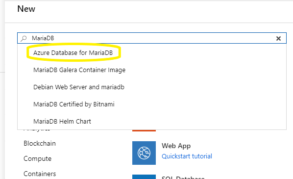
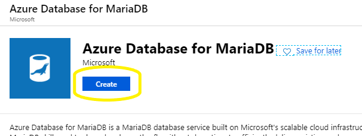
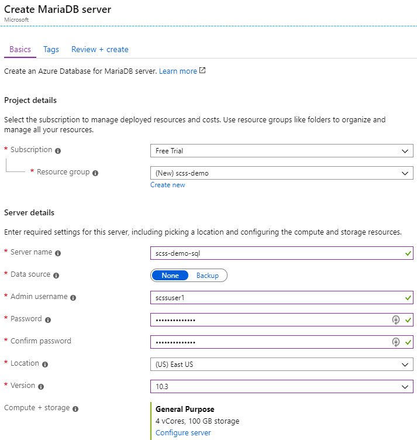
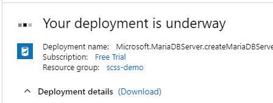
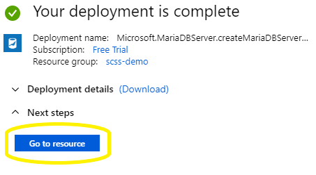
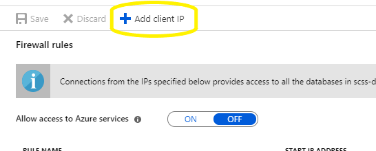
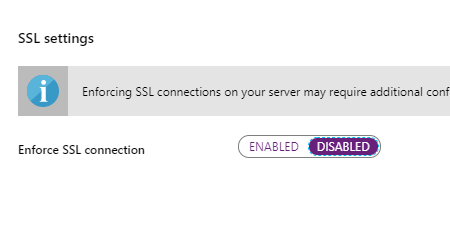
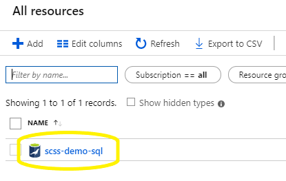
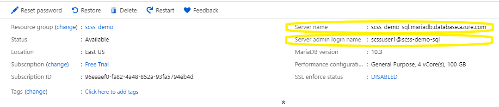

# Migrate database to Azure

## Create MariaDB
1. Navigate to the Azure portal at
   [portal.azure.com/](https://portal.azure.com/)
1. Authenticate with your supplied credentials
1. If you see a *Welcome to Microsoft Azure* dialog box, dismiss it.
1. Choose [+ Create a Resource] in the upper left hand corner of the screen.

    

1. Type **MariaDB** in the [Search the Marketplace] text box
1. Select [Azure Database for MaraiDB] from the drop down list

    

1. Click the [Create] button

    

1. Fill out the *Create Maria DB Server* form
    - *Resource group*: Choose the [Create new] link and name the new resource
        group **scss-demo**
    - *Server name*: **scss-demo-sql**
    - *Admin username*: **scssuser1**
    - *Password*: **scsspassword!1**
    - *Location*: **(US) East US**
    - *Version*: **10.3**
    - Click [Review + create] button.
    - Click [Create] button.

    

1. Wait for the *Your deployment is underway* message to go away...

    

1. Click the [Go to resource] button.

    


## Configure security to allow connection from local PI network
1. Click on the [Connection Security] link on the left hand side of the screen.

    

1. Click the [+ Add client IP] button near the top of the screen.

    

1. Change *Enforce SSL connection* to **Disabled**

    

1. Click the [Save] button near the top of the screen.

    


## Create database and transfer data
1. Obtain login information from the Azure portal
    - From the Azure portal, select the [All resources] link on the left hand
        side of the screen

        

    - Click on the [scss-demo-sql] link

        

    - Notice the *Server Name* and *Server admin login name* values. You will
        need these for future exercises.

        

    - Create Environment Variables for later use
        ```bash
        MARIA_SERVER=<Server name>
        MARIA_USER=<Server admin login name>
        ```
1. Launch the Ubuntu shell
1. Connect to the database and create resources
    ``` bash
    cd ~/cloud-migration-for-managers/punny-db/
    mysql -h $MARIA_SERVER -u $MARIA_USER --password='scsspassword!1'

    # Inside SQL Shell
    source ./cloud_setup.sql;
    exit
    ```

Congratulate yourself! You have successfully migrated a database to the cloud.
