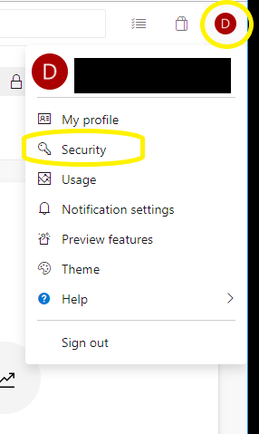
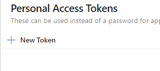
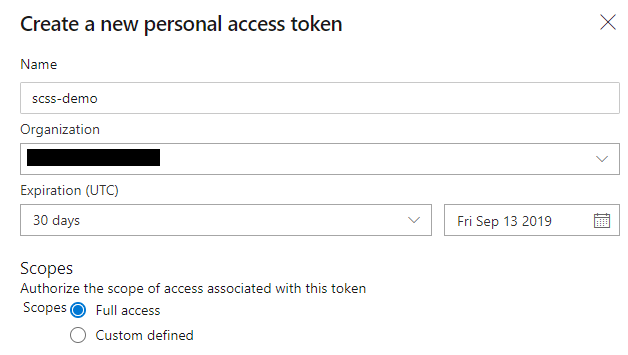
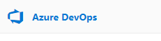
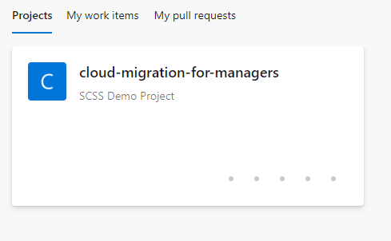
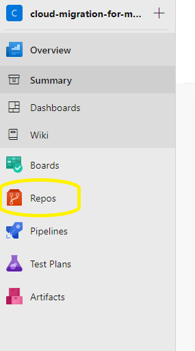
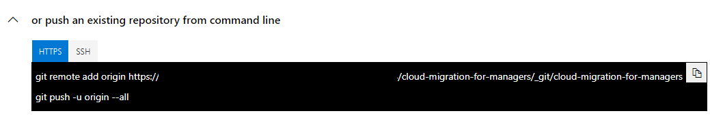
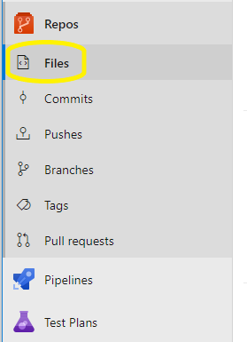

# Migrate git code repository to Azure

## Pull existing repository
1. Launch the WSL Ubuntu command line application
1. Clone the existing code repository to your local machine
    ``` bash
    git clone pi@192.168.1.3:/home/pi/cloud-migration-for-managers.git

    # Answer yes to the ECDSA host authenticity question
    # When prompted for password, type IShouldBeInTheCloud

    cd cloud-migration-for-managers
    ll

    # If the repo was cloned successfully, you should see a directory listing
    # containing punny-api, punny-db, and punny-ui directories as well as a few
    # others

    # disconnect from the pi repo
    git remote remove origin
    ```

## Create a new project
1. Navigate to
   [azure.microsoft.com/en-us/services/devops/repos/](https://azure.microsoft.com/en-us/services/devops/repos/)
1. Click the [Start Free >] Button
1. Sign in with your supplied Azure credentials
1. Fill out the *Create project o get started* form
    - *Project name*: **cloud-migration-for-managers**
    - *Description*: **SCSS Demo Project**
    - *Visibility*: **Private**
    - Click the [+ Create Project] button

## Create a personal access token
1. Click on your identity icon in the upper right hand corner of the screen and
   choose *Security* from the drop down list

    

1. Click the [+ New Token] button

    

1. Fill out the *Create a new personal access token* form
    - *Name*: **scss-demo**
    - *Scopes*: **Full access**
    - Leave remaining values as default
    - Click the [Create] button

    

1. Copy the *temp token* and put it somewhere that you access later.
    - One option is to paste the token into notepad document and save it on your
        desktop

## Push the code to the new project
1. Click the [Azure DevOps] link in the upper left hand corner

    

1. Click the [cloud-migration-for-managers] project to open it

    

1. Click the [Repos] link on the left hand side of the screen

    

1. Copy the code from [or push an existing repository from command line]
   section.

    

1. Paste the code into your Ubuntu shell
1. When prompted for a password, supply the temporary token created in the
   previous section.
1. Click the [Files] Icon under [Repos] on the left hand side of the screen and
   take a few minutes to peruse the code base.

    


