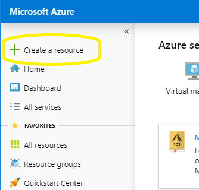
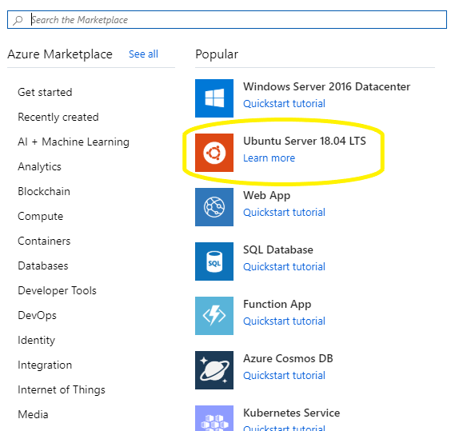
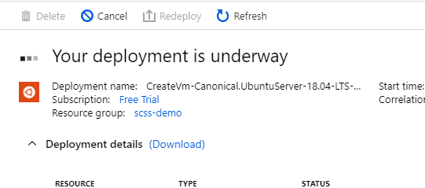
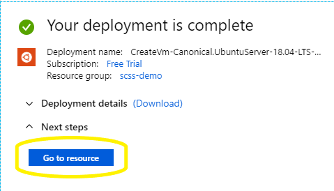
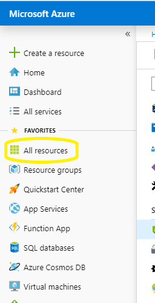
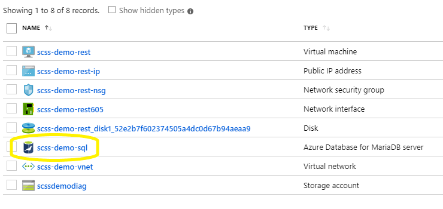
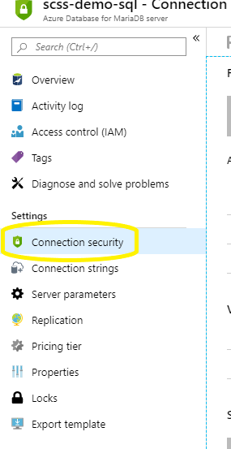
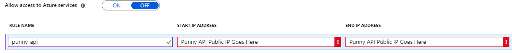
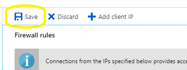
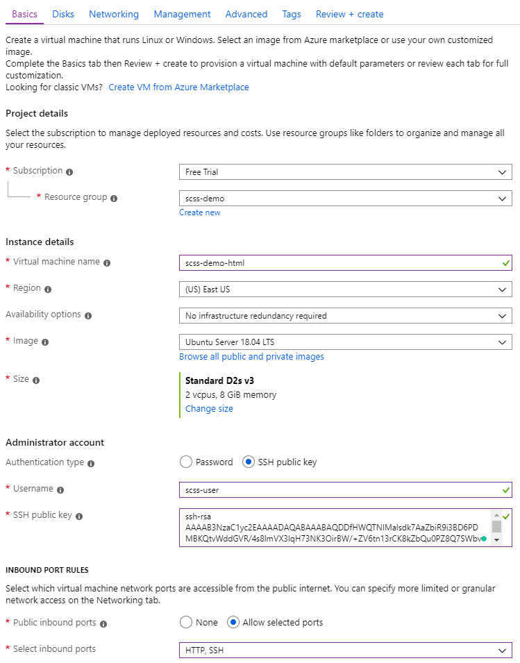

# "Lift and Shift" apps to Azure VMs

## Create SSH Keys
 Create ssh keys to use when ssh-ing into Azure machines
``` bash
ssh-keygen -t rsa -b 2048
# Press enter three times to accept the default
cat ~/.ssh/id_rsa.pub
# Save the output of the command above to for later use.
```

## Punny REST API
1. Navigate to the Azure portal at
   [portal.azure.com/](https://portal.azure.com/)
1. Authenticate with your supplied credentials
1. If you see a *Welcome to Microsoft Azure* dialog box, dismiss it.
1. Choose [+ Create a Resource] in the upper left hand corner of the screen.

    

1. Choose *Ubuntu Server 18.04 LTS] from the list of popular resources.

    

1. Fill out the *Create a virtual machine* form
    - *Resource group*: **scss-demo**
    - *Virtual machine name*: **scss-demo-rest**
    - *Authentication Type*: **SSH public key**
    - *Username*: **scss-user**
    - *SSH public key*: Copy and paste the output of `cat ~/.ssh/id_rsa.pub`
    - *Public inbound ports*: **Allow selected ports**
    - *Select inbound ports*: **SSH, HTTP**
    - Select default values for all other options
    - Click [Review + create] button.
    - Click [Create] button.

    

1. Wait for the *Your deployment is underway* message to go away...

    

1. Click the [Go to resource] button.

    

1. Note the *Public IP address*
1. Create an environment variable for later use
    ```bash
    PUNNY_API_IP={PUBLIC IP ADDRESS}
    ```
1. Update MariaDB to accept connections from the public IP address
    - Navigate to the Azure portal at
        [portal.azure.com/](https://portal.azure.com/)
    - Click the [All resources] link 

        

    - Click the [scss-demo-sql] link

        

    - Click the [Connection security] link on the right hand side

        

    - Add a new rule with the following data
        * *RULE NAME*: **punny-api**
        * *START IP ADDRESS*: **{PUBLIC IP ADDRESS}**
        * *END IP ADDRESS*: **{PUBLIC IP ADDRESS}**

        

    - Click the [Save] button near the top of the page

        

1. Connect to the server and install required libraries
    ```bash
    ssh scss-user@$PUNNY_API_IP
    # Answer **yes** to the authenticity of host question
    sudo apt update
    sudo apt upgrade -y
    sudo apt autoremove -y

    sudo apt install default-jre -y
    sudo reboot now
    ```
1. Update the connection information in the Punny API Application
    ``` bash
    cd ~/cloud-migration-for-managers/punny-api

    # the following statement simply replace text in the file
    sed -i "s/192.168.1.4:3306/$MARIA_SERVER/g" src/main/resources/application.properties
    sed -i "s/scss-user/$MARIA_USER/g" src/main/resources/application.properties
    sed -i 's/scss-password/scsspassword!1/g' src/main/resources/application.properties
    ```
1. Deploy code to the VM and start the service
    ``` bash
    # build the application
    ./gradlew build
    # Copy the file to the server
    scp ./build/libs/punny-api-0.0.1-SNAPSHOT.jar scss-user@$PUNNY_API_IP:~/
    # Start the server
    ssh scss-user@$PUNNY_API_IP sudo java -jar punny-api-0.0.1-SNAPSHOT.jar --server.port=80
    # End the ssh session
    <Ctrl+C>
    ```
1. Navigate to http://**{PUBLIC IP ADDRESS}**/api/puns to validate that the
   service is properly configured.

## Punny UI
1. Navigate to the Azure portal at
   [portal.azure.com/](https://portal.azure.com/)
1. Authenticate with your supplied credentials
1. If you see a *Welcome to Microsoft Azure* dialog box, dismiss it.
1. Choose [+ Create a Resource] in the upper left hand corner of the screen.

    

1. Choose *Ubuntu Server 18.04 LTS] from the list of popular resources.

    

1. Fill out the *Create a virtual machine* form
    - *Resource group*: **scss-demo**
    - *Virtual machine name*: **scss-demo-html**
    - *Authentication Type*: **SSH public key**
    - *Username*: **scss-user**
    - *SSH public key*: Copy and paste the output of `cat ~/.ssh/id_rsa.pub`
    - *Public inbound ports*: **Allow selected ports**
    - *Select inbound ports*: **SSH, HTTP**
    - Select default values for all other options
    - Click [Review + create] button.
    - Click [Create] button.

    

1. Wait for the *Your deployment is underway* message to go away...

    

1. Click the [Go to resource] button.

    

1. Note the *Public IP address*
1. Create an environment variable for later use
    ```bash
    PUNNY_UI_IP={PUBLIC IP ADDRESS}
    ```
1. Connect to the server and install required libraries
    ```bash
    ssh scss-user@$PUNNY_UI_IP
    # Answer **yes** to the authenticity of host question
    sudo apt update
    sudo apt upgrade -y
    sudo apt autoremove -y

    sudo apt install nginx -y
    sudo /etc/init.d/nginx start
    sudo reboot now
    ```
1. Update the api connection information in the Punny UI Application
    ``` bash
    cd ~/cloud-migration-for-managers/punny-ui
    sed -i "s/192.168.1.6/$PUNNY_API_IP:8080/g" .env
    ```
1. Rebuild and deploy the application
    ``` bash
    npm install

    # if you get an error, run the following two statements and try again
    # sudo chown -R $(whoami) ~/.npm
    # sudo chown -R $USER:$(id -gn $USER) /home/scss-demo-user/.config

    npm run build
    scp -r ./build/* scss-user@$PUNNY_UI_IP:~/
    ssh scss-user@$PUNNY_UI_IP "sudo mv ~/* /var/www/html"
    ```
1. Navigate to http://{**PUBLIC IP ADDRESS**} to view the apps running in VMs in
   the cloud

Congratulate yourself! You have successfully migrated your entire application to
the cloud. The data center is no more!

## Delete the existing VMs
There are spending limits on the demo accounts, so we must delete the existing
VMs in order to create our Kubernetes cluster. This is a slow command so kick it
off before a break.

``` bash
az vm delete --ids $(az vm list -g scss-demo --query "[].id" -o tsv) --yes
```
