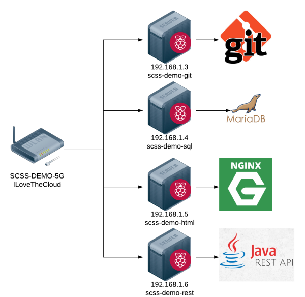

# Raspberry Pi Setup Instructions

The workshop utilized 4 Raspberry Pi configured to resemble an on-premise data
center.



Equipment:

- Netgear WNDR3400v3 Router
- TP-Link 5 Port Gigabit Ethernet Network Switch
- Raspberry Pi 3 Model B X 4
- 32GB SanDisk Micro SD Card (Class 10) X 4
- ABOX 5V 3A USB power supply X 4
- ABS plastic Raspberry Pi case X 4
- Ethernet Cables

## Load Raspberry PI Operating Systems

1. Download the _Raspbian Buster Lite_ image from
   [www.raspberrypi.org/downloads/raspbian/](https://www.raspberrypi.org/downloads/raspbian/)
1. Use [Etcher](https://www.balena.io/etcher/) to burn the image to each SD card
1. On the SD card, create an empty file named **ssh** in the boot directory

## Configure Router

1. Plug all pis into the network switch
1. Plug network switch into the router
1. Connect router to an internet connection
1. Connect to the router using the default SSID and key (listed on bottom of
router)
1. Navigate to router admin page [192.168.1.1](http://192.168.1.1)
1. Change the admin password at _Advanced_ -> _Administration_ -> _Set
   Password_. Keep this in a safe place because it can't be retrieved.
1. Change the SSID and Key at _Advanced_ -> _Setup_ -> _Wireless Setup_
   - SSID = **SCSS-DEMO** and **SCSS-DEMO-5G**
   - Key = **ILoveTheCloud**
1. Add Static IP Address Reservations for each pi at _Advanced_ -> _Setup_ ->
   _LAN Setup_
   - Git Server - **192.168.1.3**
   - SQL Server - **192.168.1.4**
   - Web Server - **192.168.1.5**
   - REST Server - **192.168.1.6**

## Configure Pi Passwords and Host names

Connect to the each pi and open the configuration tool

```bash
ssh pi@<PI IP ADDRESS>
# use password raspberry
sudo raspi-config
```

1. Choose _Change User Password_ and follow instruction. Set password to
**IShouldBeInTheCloud**
1. Choose _Network Options_ -> _Hostname_ and set the name to:
   - Git Server - 192.168.1.3 - **scss-demo-git**
   - SQL Server - 192.168.1.4 - **scss-demo-sql**
   - Web Server - 192.168.1.5 - **scss-demo-html**
   - REST Server - 192.168.1.6 - **scss-demo-rest**
1. Reboot when prompted

Get all the latest updates

```bash
sshpass -p IShouldBeInTheCloud ssh pi@<PI IP ADDRESS>
sudo apt update
sudo apt upgrade -y
sudo apt autoremove -y
```

## Configure Git Server

Install Git Server
```bash
sshpass -p IShouldBeInTheCloud ssh pi@192.168.1.3
sudo apt install wget git-core -y

# Create the initial repo
mkdir cloud-migration-for-managers.git
cd cloud-migration-for-managers.git
git init --bare
```

Push this repo, to the pi - make sure you do this locally, not on the pi. Also,
ensure you in the repo's root directory.

```bash
git remote add pi pi@192.168.1.3:/home/pi/cloud-migration-for-managers.git
git push pi
```

NOTE: If you have trouble due to repeated password prompts, configure
passwordless SSH login by following [these
steps](https://linuxize.com/post/how-to-setup-passwordless-ssh-login/)

## Configure Maria DB

Install Maria DB

``` bash
sshpass -p IShouldBeInTheCloud ssh pi@192.168.1.4
sudo apt update
sudo apt install mariadb-server -y

# Fix a bug that prevents mysql login from linux machines
sudo mysql -u root

UPDATE mysql.user SET plugin='mysql_native_password' WHERE User='root';
FLUSH PRIVILEGES;
exit

# Set up security
sudo mysql_secure_installation
# When prompted for password, type IShouldBeInTheCloud
# Answer Y to all other queries
```

The root password is now **IShouldBeInTheCloud**


Configure remote login
``` bash
# edit this file
sudo vi /etc/mysql/mariadb.conf.d/50-server.cnf

# change the following line
# bind-address                              = 127.0.0.1
# to
# bind-address                               = 0.0.0.0

sudo systemctl restart mariadb.service
```

Disconnect from any ssh sessions and run the following script from the punny-db
directory to create the database, users, and initial data. 

``` bash
./pi_setup.bash
```

The following should be set up:
- DB Name: **scss_punny_db**
- User: **scss-user**
- Password: **scss-password**

NOTE: additional data can be loaded by editing the data.txt file and then
running the pi_setup.bash script again.

Configure remote connectivity

``` bash
# Install client app
sudo apt install mariadb-client -y

# Remote connection
mysql -h 192.168.1.4 -P 3306 --password=scss-password -u scss-user scss_punny_db
```

## Configure REST API

Install Java 11 and configure auto startup

``` bash
sshpass -p IShouldBeInTheCloud ssh pi@192.168.1.6

sudo apt update
sudo apt upgrade -y
sudo apt install default-jre -y

sudo vi /etc/rc.local
# Add /home/pi/start_app.bash before exit 0
```

Disconnect from any ssh sessions and run the following script from the punny-api
directory to configure the REST API.

``` bash
./pi_setup.bash
```

The app can be rebuild and deployed at any time by running the following script
from the punny-api directory.

``` bash
./pi_deploy.bash
```

Note: The application is configured to run on port 8080. On linux ports below
1024 can be opened only by root, so the port 80 is restricted by default. There
are ways around this, but most likely not worth it for this app: More info
[here](https://stackoverflow.com/questions/33703965/how-can-i-run-a-spring-boot-application-on-port-80)

## Configure HTML Front End

Install NGINX

``` bash
sshpass -p IShouldBeInTheCloud ssh pi@192.168.1.5

sudo apt update
sudo apt upgrade -y
sudo apt install nginx -y
sudo /etc/init.d/nginx start
```

Disconnect from any ssh sessions and run the following script from the punny-ui
directory to build and deploy the front end code.

``` bash
./pi_deploy.bash
```

The application can be redeployed at any time by re-running the above script.

## Quick Reference
- Router
    Router Admin: 192.168.1.1
    User: admin
    Password: <redacted>

    Wireless
    SSID: SCSS-DEMO or SCSS-DEMO-5G
    Key: ILoveTheCloud

- Git Server
    192.168.1.3
    Hostname: scss-demo-git
    User: pi
    Password: IShouldBeInTheCloud

- SQL Server
    192.168.1.4
    Hostname: scss-demo-sql
    User: pi
    Password: IShouldBeInTheCloud

- Web Server
    192.168.1.5
    Hostname: scss-demo-html
    User: pi
    Password: IShouldBeInTheCloud

- REST Server
    192.168.1.6
    Hostname: scss-demo-rest
    User: pi
    Password: IShouldBeInTheCloud
