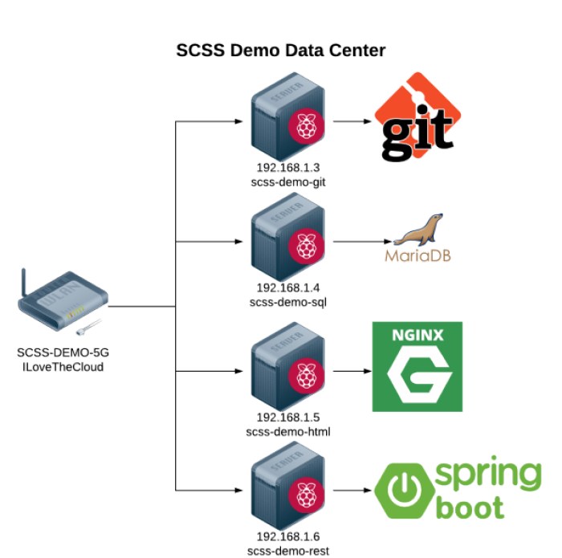

# Raspberry Pi Setup Instructions

The workshop utilized 4 Raspberry Pi configured to resemble an on-premise data
center.



Equipment:

- Netgear WNDR3400v3 Router
- TP-Link 5 Port Gigabit Ethernet Network Switch
- Raspberry Pi 3 Model B X 4
- 32GB SanDisk Micro SD Card (Class 10) X 4
- ABOX 5V 3A USB power supply X 4
- ABS plastic Raspberry Pi case X 4
- Ethernet Cables

## Load Raspberry PI Operating Systems

1. Use Etcher to burn the image located in the pi_image directory to each SD
   card
1. On the SD card, create an empty file named ssh in the boot directory

## Configure Router

1. Plug all pis into the network switch
1. Plug network switch into the router
1. Connect router to an internet connection
1. Connect to the router using the default SSID and key (listed on bottom of
   router)
1. Navigate to router admin page [192.168.1.1](http://192.168.1.1)
1. Change the admin password at _Advanced_ -> _Administration_ -> _Set
   Password_. Keep this in a safe place because it can't be retrieved.
1. Change the SSID and Key at _Advanced_ -> _Setup_ -> _Wireless Setup_
   - SSID = **SCSS-DEMO** and **SCSS-DEMO-5G**
   - Key = **ILoveTheCloud**
1. Add Static IP Address Reservations for Each pi at _Advanced_ -> _Setup_ ->
   _LAN Setup_
   - Git Server - **192.168.1.3**
   - SQL Server - **192.168.1.4**
   - Web Server - **192.168.1.5**
   - REST Server - **192.168.1.6**

## Configure Pi Passwords and Host names

Connect to the each pi and open the configuration tool

```bash
sshpass -p raspberry ssh pi@<PI IP ADDRESS>
sudo raspi-config
```

1. Choose _Change User Password_ and follow instruction. Set password to
   **IShouldBeInTheCloud**
1. Choose _Network Options_ -> _Hostname_ and set the name to:
   - Git Server - 192.168.1.3 - **scss-demo-git**
   - SQL Server - 192.168.1.4 - **scss-demo-sql**
   - Web Server - 192.168.1.5 - **scss-demo-html**
   - REST Server - 192.168.1.6 - **scss-demo-rest**

Get all the latest updates

```bash
sshpass -p raspberry ssh pi@<PI IP ADDRESS>
sudo apt update
sudo apt upgrade -y
sudo apt autoremove
```

## Configure Git Server

Install Git Server
```bash
sshpass -p IShoudBeInTheCloud ssh pi@192.168.1.3
sudo apt install wget git-core -y

// Create the initial repo
mkdir cloud-migration-for-managers
cd cloud-migration-for-managers/
git init --bare
```
